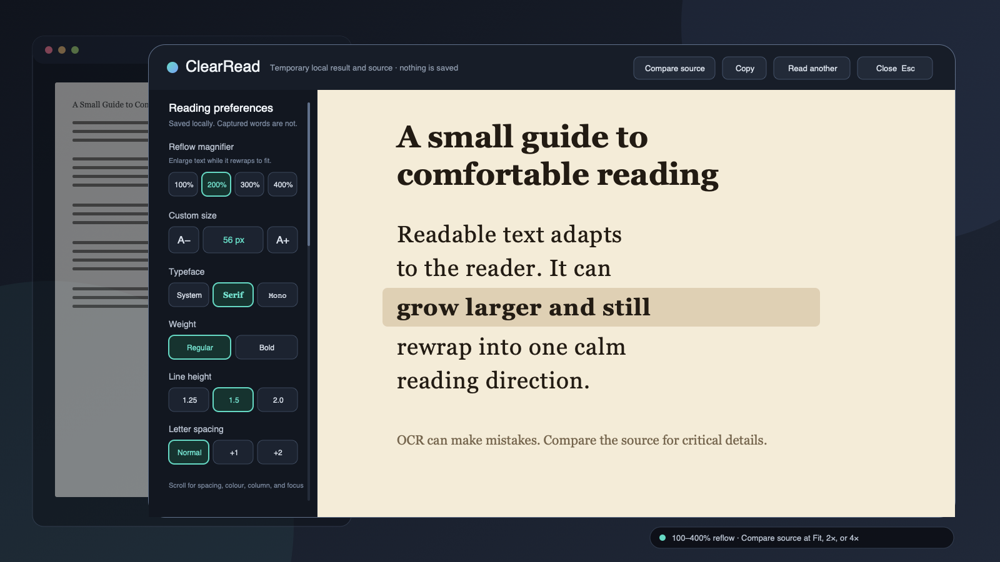

# ClearRead for Omarchy

If text is visible, it should be readable.

ClearRead turns text trapped in screenshots, scanned documents, videos,
canvas apps, and remote desktops into a calm, adjustable reading surface.
Select what you want to read. ClearRead recognizes it locally, reflows the
words, and gets out of the way.

It is the difference between making pixels larger and making text readable.



## What it does

- Reads the active window without requiring a pointer.
- Uses Omarchy's native picker for a precise screen region.
- Opens existing clipboard text without taking a screenshot.
- Reflows recognized text at a comfortable line length.
- Magnifies recognized text from 100% to 400% without horizontal reading.
- Lets window and region reads compare OCR with the exact captured pixels.
- Adjusts typeface, size, weight, line height, letter spacing, word spacing,
  column width, contrast, and line focus.
- Works from the keyboard, including capture, reading, copying, and closing.

ClearRead is local and transient. It creates no named screenshot, OCR history,
account, analytics record, or network request. After local recognition, an
eligible window or region image may remain in a sealed anonymous memory file
so **Compare source** can verify the OCR. ClearRead releases it when the reader
closes or starts another read. Recognized text is discarded from ClearRead at
the same boundary. Text the user explicitly copied remains on the normal
Wayland clipboard. Only presentation preferences remain in ClearRead.
The standard `wl-copy` implementation may use a private, transient unlinked
backing file while it owns that explicitly requested clipboard selection; it
does not create ClearRead history or a named plugin file.

## Try it

Omarchy plugins run inside the long-lived shell without a sandbox, so review
this repository before installing it.

```bash
omarchy plugin add https://github.com/josephbriones/omarchy-clearread.git --enable
omarchy-shell shell summon io.github.josephbriones.clearread '{"demo":true}'
```

The demo uses fixed sample text. It does not inspect the screen, open the
clipboard, or start Tesseract.

## Use it

Open ClearRead:

```bash
omarchy-shell shell toggle io.github.josephbriones.clearread
```

Then choose one explicit action:

- **Read active window** captures the application behind ClearRead. This is
  the fully keyboard-operated path.
- **Select screen area** hides ClearRead and opens Omarchy's native region
  picker. Escape cancels the selection.
- **Read clipboard** reflows text already on the clipboard without capturing
  the screen.

ClearRead hides its own surface before pixel capture. Once the image is in
memory, it returns with a local recognition state and then opens the reader.
Window and region results may offer **Compare source**, a temporary Fit, 2x,
or 4x view of the exact pixels sent to OCR. This is useful for checking names,
amounts, model numbers, punctuation, and other details OCR can misread. The
button is absent for clipboard text, demo mode, or when sealed anonymous
memory is unavailable. A captured PNG above 32,768 pixels on either axis or
33,177,600 decoded pixels is rejected before OCR with a prompt to choose a
smaller window or screen area.

In the reader, Tab moves through every control, including the explicit
**Copy** button. Other useful keys:

| Key | Action |
|---|---|
| `Ctrl` + `+` / `Ctrl` + `-` | Increase or decrease text size |
| `Ctrl` + `1` / `2` / `3` / `4` | Set 100%, 200%, 300%, or 400% reflow magnification |
| `Ctrl` + `0` | Restore the default text size |
| `Page Up` / `Page Down` | Move one viewport |
| `Home` / `End` | Move to the start or end |
| `Escape` | Return from Compare source, cancel recognition, or close ClearRead |

In **Compare source**, `+` and `-` change pixel magnification, `0` fits the
image, arrow keys pan, and Escape returns to the reflowed text.

Copying is always explicit. ClearRead never replaces the clipboard merely
because it recognized text.

ClearRead magnifies words and keeps them wrapped into one reading direction.
For diagrams, controls, or other visual layout, use Omarchy's native screen
zoom with `Super + Ctrl + Z`; reset it with `Super + Ctrl + Alt + Z`.

## Local requirements

ClearRead targets current Omarchy Quattro. It uses the capture and OCR tools
already present in a standard installation: Omarchy's region picker, `grim`,
`tesseract`, `wl-clipboard`, Hyprland tools, Python, and `setpriv`.

English OCR data is part of the standard installation. Additional Tesseract
languages are optional. ClearRead honors `OMARCHY_OCR_LANGS`, using `eng` when
it is unset. The value is limited to lowercase ASCII language codes containing
letters, digits, or underscores, joined with `+`, such as `eng+spa`; the whole
value may be at most 120 characters. The [setup guide](docs/SETUP.md) covers
language checks and the local doctor command.

Opening ClearRead checks these local capabilities. It never installs a
package, downloads language data, changes a global shortcut, or rewrites
Omarchy, Hyprland, Tesseract, or clipboard configuration.

## Deliberately small

ClearRead is an accessible presentation layer, not an OCR filing cabinet.

- No named or saved images, text archive, search history, or watched region.
- No automatic capture or clipboard watcher.
- No duplicate live screen magnifier or continuous frame capture.
- No cloud OCR, translation, summarization, or generated rewriting.
- No automatic clipboard write.
- No claim that OCR is exact. The reader labels recognized text so critical
  details can be checked against the source.
- No claim to replace a screen reader or expose document semantics.

Handwriting, equations, tables, complex columns, and protected surfaces may
recognize poorly or not at all. Accuracy depends on source size, contrast,
language data, and Tesseract.

## Remove it

Close ClearRead, then use Omarchy's normal removal path:

```bash
omarchy plugin remove io.github.josephbriones.clearread
```

Removal leaves the small presentation-settings file alone. It contains no
captured image or recognized text; [Privacy](PRIVACY.md) documents its exact
fields and location.

## Development

Run the portable suite:

```bash
bash scripts/validate.sh
```

The tests use fake capture and OCR tools, so they exercise the capture, OCR, clipboard, failure, and cleanup protocols without inspecting the developer's screen. Real Hyprland, multi-display, keyboard-focus, and OCR-quality checks remain explicit Omarchy acceptance gates; see [Testing](docs/TESTING.md).

The [architecture](docs/ARCHITECTURE.md) describes the capture boundary and
process lifecycle. [Security](SECURITY.md) explains the threat model.

## License

[MIT](LICENSE) © 2026 Joseph Briones.
